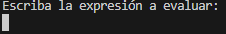
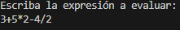
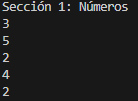
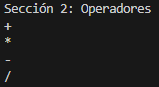
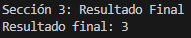

# Documentación de Código Java - Ejercicio10


## Índice
1. [Introducción](#introducción)
2. [Clase Pilas](#clase-pilas)
   - 1.1 [Método main](#método-main)
   - 1.2 [Método mostrarNumerosSeparados](#método-mostrarnumerosseparados)
   - 1.3 [Método mostrarOperadoresSeparados](#método-mostraroperadoresseparados)
3. [Clase Metodos](#clase-metodos)
   - 2.1 [Método constructor](#método-constructor)
   - 2.2 [Método insertar](#método-insertar)
   - 2.3 [Método eliminarUltimo](#método-eliminarultimo)
   - 2.4 [Método vacia](#método-vacia)
4. [Clase Nodo](#clase-nodo)
   - 3.1 [Atributos](#atributos)
   - 3.2 [Método constructor](#método-constructor)
5. [Uso del Programa](#uso-del-programa)


---

## Introducción

Esta documentación tiene como objetivo explicar el funcionamiento y la implementación del código Java correspondiente al Ejercicio10. El código consiste en un programa que evalúa expresiones matemáticas simples utilizando pilas.

El programa solicita al usuario que ingrese una expresión matemática válida y luego la evalúa para mostrar el resultado final. Utiliza una pila para almacenar tanto los números como los operadores de la expresión, realizando las operaciones matemáticas en el orden correcto.

A lo largo de este documento, se proporcionará una explicación detallada de las clases `Pilas`, `Metodos` y `Nodo`, así como de los métodos y atributos que componen cada una de ellas.

## Clase Pilas

La clase `Pilas` es la clase principal del programa y se encarga de coordinar la evaluación de una expresión matemática. Esta clase utiliza instancias de la clase `Metodos` para manejar tanto los números como los operadores de la expresión.

### Método main

El método `main` es el punto de entrada del programa. Realiza las siguientes tareas:

- Solicita al usuario que ingrese una expresión matemática válida.
- Divide la expresión en números y operadores.
- Utiliza instancias de la clase `Metodos` para almacenar los números y operadores en pilas separadas.
- Realiza operaciones matemáticas según los operadores y muestra el resultado final.

### Método mostrarNumerosSeparados

Este método recorre la expresión dada por el usuario y muestra los números que contiene.

```java
    public static void mostrarNumerosSeparados(String expresion) {
        for (char c : expresion.toCharArray()) {
            if (Character.isDigit(c)) {
                System.out.println(c);
            }
        }
    }
```

### Método mostrarOperadoresSeparados

Este método recorre la expresión dada por el usuario y muestra los operadores que contiene.

```java
    public static void mostrarOperadoresSeparados(String expresion) {
        for (char c : expresion.toCharArray()) {
            if (!Character.isDigit(c) && c != '=') {
                System.out.println(c);
            }
        }
    }
```

## Clase Metodos

La clase `Metodos` implementa una estructura de datos de pila para almacenar y manipular elementos. Esta clase se utiliza en la clase `Pilas` para manejar tanto los números como los operadores de la expresión matemática ingresada por el usuario.

### Atributos

| Atributo | Descripción                    |
|----------|--------------------------------|
| inicio   | Nodo que señala al inicio de la pila. |
| fin      | Nodo que señala al final de la pila.  |

### Métodos

#### Método constructor

```java
    public Metodos() {
        inicio = null;
        fin = null;
    }
```

El constructor de la clase `Metodos` inicializa los atributos `inicio` y `fin` como `null`, indicando que la pila está vacía al inicio.

### Método insertar

El método `insertar` permite agregar un nuevo elemento a la pila. Recibe como parámetro el elemento a insertar y crea un nuevo nodo con dicho elemento. Si la pila está vacía, el nuevo nodo se convierte tanto en el primer como en el último elemento de la pila. En caso contrario, el nuevo nodo se coloca al final de la pila y se actualiza el puntero `fin`.

```java
    public void insertar(String elemento) {
        Nodo nuevo = new Nodo(elemento);
        if (vacia()) {
            inicio = nuevo;
            fin = nuevo;
        } else {
            fin.sig = nuevo;
            fin = nuevo;
        }
    }
```

### Método eliminarUltimo

El método `eliminarUltimo` elimina y devuelve el último elemento de la pila. Si la pila está vacía, muestra un mensaje indicando que no se puede eliminar ningún elemento. Si hay solo un elemento en la pila, se elimina ese elemento y se actualizan los punteros `inicio` y `fin` para que apunten a `null`. Si hay más de un elemento en la pila, se recorre la pila hasta encontrar el penúltimo nodo, se elimina el último nodo y se actualiza el puntero `fin`.

```java
    public String eliminarUltimo() {
        if (vacia()) {
            System.out.println("La pila está vacía. No se puede eliminar ningún elemento.");
            return null;
        } else if (inicio == fin) {
            String elemento = inicio.elemento;
            inicio = null;
            fin = null;
            return elemento;
        } else {
            Nodo aux = inicio;
            while (aux.sig != fin) {
                aux = aux.sig;
            }
            String elemento = fin.elemento;
            aux.sig = null;
            fin = aux;
            return elemento;
        }
    }
```

### Método vacia

El método `vacia` verifica si la pila está vacía. Devuelve `true` si tanto inicio como `fin` apuntan a `null`, lo que indica que la pila está vacía. Devuelve `false` en caso contrario.

```java
    public boolean vacia() {
        return inicio == null;
    }
```

## Clase Nodo

La clase `Nodo` define la estructura de un nodo en una lista enlazada, que se utiliza para implementar la pila en la clase `Metodos`.

| Atributo | Descripción                    |
|----------|--------------------------------|
| elemento   | Este atributo almacena el valor del nodo. |
| sig      | Este atributo es una referencia al siguiente nodo en la lista enlazada.  |

### Método constructor

```java
    public Nodo(String elemento) {
        this.elemento = elemento;
        this.sig = null;
    }
```

El constructor de la clase `Nodo` recibe como parámetro el valor del nodo y lo asigna al atributo `elemento`. Inicializa el atributo `sig` como `null`.

La clase `Nodo` proporciona la estructura básica para construir una lista enlazada, que es utilizada en la implementación de la pila en la clase `Metodos`. Cada nodo contiene un valor y una referencia al siguiente nodo, permitiendo así la construcción de una estructura de datos dinámica y eficiente para almacenar elementos.

## Uso del Programa

El programa permite al usuario evaluar expresiones matemáticas simples ingresadas por teclado. A continuación, se muestra cómo utilizar el programa:

1. **Ejecución del Programa:**
   - Compila y ejecuta el programa Java en tu entorno de desarrollo preferido.
   - Una vez iniciado el programa, verás un mensaje que solicita que ingreses una expresión matemática.

   


2. **Ingresar la Expresión Matemática:**
   - Ingresa una expresión matemática válida en la consola y presiona Enter.
   - La expresión matemática puede contener números enteros y los operadores `+`, `-`, `*`, `/`.
   - Por ejemplo: `3+5*2-4/2`.

   


3. **Visualización de los Resultados:**
   - El programa dividirá la expresión en números y operadores y mostrará cada parte por separado.

   


    

   - Luego, realizará las operaciones matemáticas según el orden de precedencia de los operadores y mostrará el resultado final.

   


4. **Salir del Programa:**
   - Para salir del programa, simplemente cierra la ventana de la consola o detén la ejecución del programa desde tu entorno de desarrollo.

¡Eso es todo! Puedes utilizar el programa y evaluar expresiones matemáticas de forma sencilla y rápida.
